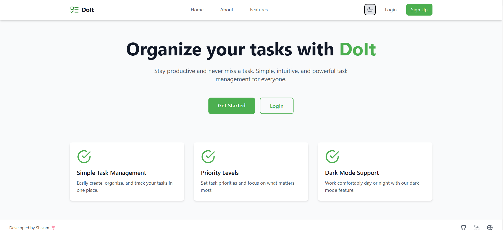
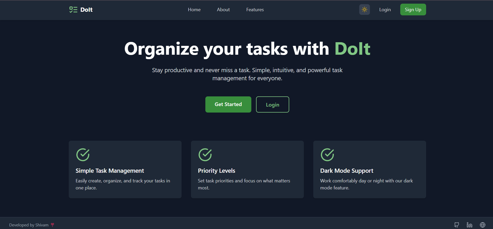
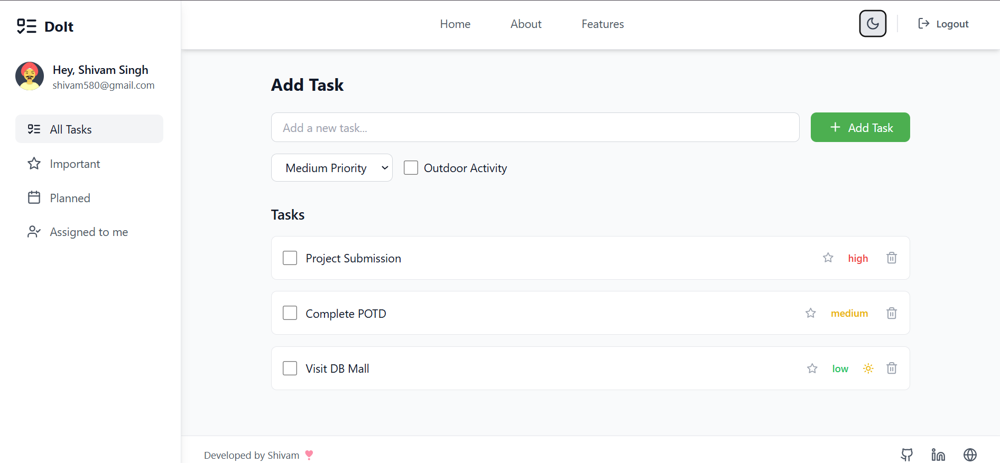
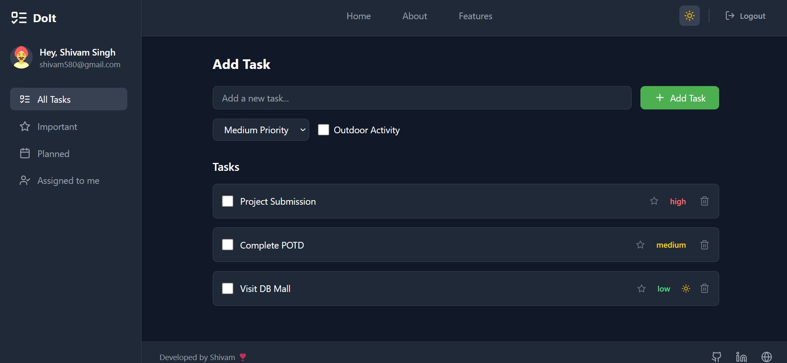
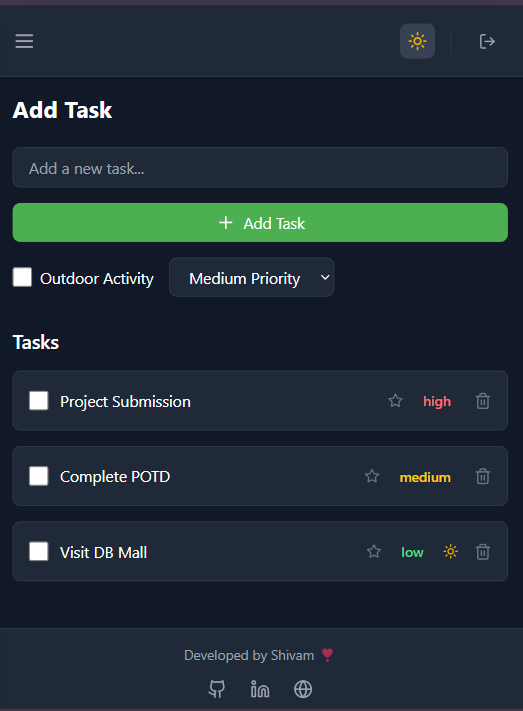
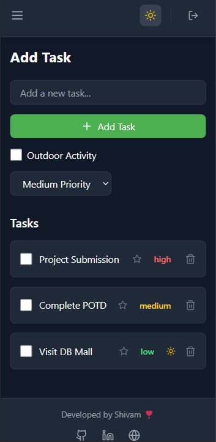

# 🚀 **DoIt** - Advanced Todo Application

_A beautiful, feature-rich todo application built with React, Redux, and TypeScript._

Live Link : https://dolt.vercel.app
---

## ✨ **Features**

### 🌟 **Core Functionality**
- ✅ Task Management (Create, Read, Update, Delete)
- 🎯 Task Prioritization (Low, Medium, High)
- 🌤️ Weather Integration for Outdoor Tasks
- 🌙 Dark/Light Theme Support
- 📱 Fully Responsive Design

### 🌟 **User Experience**
- 🔐 User Authentication
- 💾 Persistent Storage
- 🎨 Beautiful UI/UX
- ⚡ Real-time Updates

### 🌟 **Task Organization**
- ⭐ Important Tasks
- 📅 Planned Tasks
- 👥 Task Assignment
- 🏷️ Priority Labels

---

## 🛠️ **Tech Stack**

- **Frontend Framework**: React
- **State Management**: Redux Toolkit
- **Styling**: Tailwind CSS
- **Icons**: Lucide React
- **Type Safety**: TypeScript
- **Build Tool**: Vite
- **API Integration**: OpenWeather API

---

## 🚀 **Getting Started**

### Prerequisites
- Node.js (v14 or higher)
- npm or yarn

### Installation

1. **Clone the repository**
   ```bash
   git clone https://github.com/shibbu04/Dolt/
   ```

2. **Install dependencies**
   ```bash
   cd Dolt
   npm install
   ```

3. **Create a `.env` file** in the root directory and add your OpenWeather API key:
   ```env
   VITE_WEATHER_API_KEY=your_api_key_here
   ```

4. **Start the development server**
   ```bash
   npm run dev
   ```

---

## 🌟 **Usage**

### **Authentication**
- Sign up with email and password
- Login to access your tasks
- Persistent sessions

### **Task Management**
- Add new tasks with priority levels
- Mark tasks as complete
- Delete tasks
- Flag tasks as important
- Set outdoor tasks with weather information

### **Organization**
- Filter tasks by status
- View important tasks
- Check planned tasks
- See assigned tasks

### **Theme**
- Toggle between light and dark themes
- Persistent theme preference

---

## 📂 **Project Structure**

```plaintext
Dolt/
├── src/
│   ├── components/      # Reusable components
│   ├── hooks/           # Custom React hooks
│   ├── pages/           # Application pages
│   ├── store/           # Redux store and slices
│   ├── types/           # TypeScript type 
│   ├── App.tsx          # Main application
│   ├── index.css        # Global CSS styles
│   ├── main.tsx         # Entry point
│   └── vite-env.d.ts    # Vite environment var
├── .env                 # Environment variables
├── .gitignore           # Git ignore rules
├── eslint.config.js     # ESLint configuration
├── index.html           # HTML template
├── package.json         # Node.js dependencies
├── postcss.config.js    # PostCSS configuration
├── README.md            # Project documentation
├── tailwind.config.js   # Tailwind CSS configuration
├── tsconfig.app.json    # TypeScript configuration for app
├── tsconfig.json        # Global TypeScript configuration
├── tsconfig.node.json   # TypeScript configuration for Node.js
└── vite.config.ts       # Vite configuration
```

---

## 📸 **Screenshots**

### **Home Page Light Mode**

### **Home Page Dark Mode**

### **User Dashboard Light Mode**

### **User Dashboard Dark Mode**

### **User Dashboard Tablet View**

### **User Dashboard Mobile View**



---

## 🤝 **Contributing**

Contributions are welcome! Please feel free to submit a Pull Request.

---

## 👨‍💻 **Author**

Created with ❤️ by **Shivam Singh**

- **GitHub**: [@Shibbu04](https://github.com/shibbu04/)
- **LinkedIn**: [Shivam Singh](https://linkedin.com/in/shivamsingh57680)
- **Portfolio**: [Shivam.tech](https://shivam04.tech)

